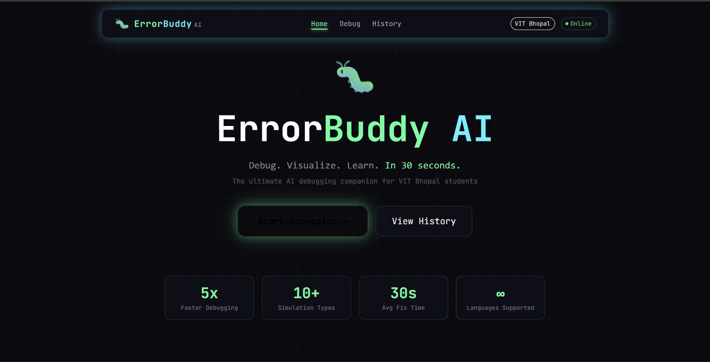

# ErrorBuddy AI
### Code Error Explainer and Educational Debugging Copilot
**Team Elevate AI | Hack Matrix 2026**

---

## Deployment Status: Successfully Hosted
While many teams encountered significant technical hurdles during the deployment phase, ErrorBuddy AI is fully hosted and operational. We have successfully integrated our React frontend with a live Node.js backend to ensure the platform is accessible to users immediately.

### Project Links
* **Live Demo**: [Website](https://errorbuddy.vercel.app/)
* **Project Report**: [View Detailed Report](https://drive.google.com/file/d/1-kOLcrBxy9T1kZve1LQwyF5lBY2tspgZ/view?usp=sharing)
* **Presentation Slides**: [View PPT](https://docs.google.com/presentation/d/1DT9w6kJaC1tYKABjh2MM6xnWL1B-reV5/edit?usp=sharing&ouid=109912913108722168119&rtpof=true&sd=true)

---

## 1. Problem Statement
* **Complexity for Beginners**: Standard error messages are often cryptic and difficult for students or self-taught programmers to interpret.
* **Logic vs. Answers**: Existing tools focus on giving the final answer rather than building a fundamental understanding of the logic.
* **Dependency Risks**: Beginners frequently rely on solutions without learning, which leads to repeated mistakes and weak technical fundamentals.
* **Solution Gaps**: Current solutions like Stack Overflow or standard compilers provide generic answers without visual intuition.

---

## 2. Proposed Solution
ErrorBuddy AI is an AI-powered debugging copilot designed to transform debugging into a learning experience.
* **Plain-English Explanations**: Converts complex syntax errors into simple, understandable insights alongside auto-fixed code.
* **Visual Learning**: Generates interactive DSA and ML visualizations to help users see how data flows through their code.
* **Hybrid Intelligence**: Features Smart Processing that switches between Gemini 2.5 Flash (Online) and Ollama (Offline) based on internet availability.
* **Contextual Memory**: Tracks user error patterns to prevent repeated mistakes and personalize the learning curve.

---

## 3. Dashboard Preview

### Error History Dashboard and Live Logic Simulation

(assests/2.jpeg)
(assests/3.jpeg)
(assests/4.jpeg)
(assests/5.jpeg)

A clean snapshot of the history dashboard and the real-time simulation experience.

---

## 4. Key Features
* **AI Error Detection and Auto-Fix**: Automatically identifies errors and provides optimized, repaired code snippets.
* **Offline Support**: Utilizes the Ollama local LLM to ensure debugging capability even in no-internet environments.
* **Real-time Visual Simulations**: Renders dynamic logic graphs using tools like Mermaid and Manim.
* **History Dashboard**: A personalized log that tracks error history and user progress over time.
* **Codebase Scanner**: A dedicated Flutter desktop application for scanning and auto-patching local project folders.

---

## 5. Tech Stack

### Frontend and Desktop

### Backend and AI

---

## 6. System Architecture
1. **Ingestion Phase**: The user pastes code and errors into the React web app or links a local project via the Flutter desktop app.
2. **Logic Processing**: The backend detects connectivity and routes the request to Gemini (Online) or Ollama (Offline).
3. **Visual Generation**: The AI identifies if a simulation is needed and triggers the visualization engine like Manim or Mermaid.
4. **Feedback Loop**: Corrected code is provided, and the error is logged to the History Dashboard for progress tracking.

---

## 7. Implementation Roadmap
* **React UI**: Core web prototype built and running.
* **Gemini API**: AI integration implemented for real-time responses.
* **Visual Simulations**: Visual simulation module currently in progress.
* **Desktop Application**: Flutter desktop scanner partially completed.

---

## 8. Team: Elevate AI
* **Khushi Roy**
* **Maddala Jashwanth**

---
"Making coding accessible, one error at a time."
